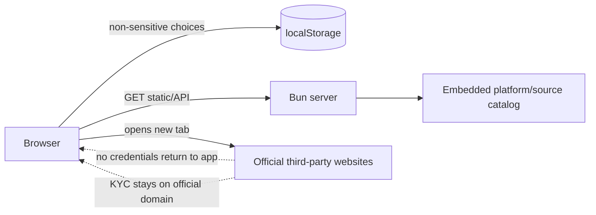
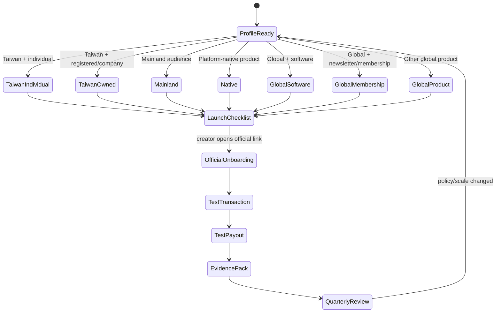

# Architecture

## Goals

- Run with Bun and TypeScript without a frontend framework.
- Keep recommendations deterministic and testable.
- Separate evidence from platform claims and business rules.
- Never handle creator credentials, KYC documents or banking secrets.
- Make every platform route replaceable.

## Repository map

```text
paid-content-create/
├── public/
│   └── index.html                 # semantic application shell
├── scripts/
│   └── build.ts                   # Bun browser bundle + static copy
├── src/
│   ├── client.ts                  # DOM rendering and localStorage state
│   ├── server.ts                  # Bun static/API server + security headers
│   ├── styles.css                 # tokens, layout and core shell
│   ├── styles-components.css      # router and catalog components
│   ├── styles-responsive.css      # calculator, evidence, responsive/print
│   ├── types.ts                   # shared contracts
│   ├── data/
│   │   ├── platforms.ts           # verified platform catalog
│   │   └── sources.ts             # official/government/research registry
│   └── domain/
│       ├── recommendation-engine.ts
│       └── payout-cost.ts
├── tests/
│   └── run.ts                     # decision and registry invariants
└── docs/
    ├── SOLUTION.zh-TW.md
    ├── ARCHITECTURE.md
    ├── DATA-FLOW.md
    ├── DECISION-RULES.md
    ├── PLATFORM-CATALOG.md
    ├── SOURCE-PROVENANCE.md
    ├── DEPLOYMENT.md
    ├── LEGAL-DISCLAIMER.md
    └── ROADMAP.md
```

## Component responsibilities

### `src/data/sources.ts`

Source-of-truth registry.

A source record includes:

- authority level
- official URL or research-artifact identity
- review date
- exact supported claims
- qualification notes

No platform claim may become `official` unless a primary source supports it.

### `src/data/platforms.ts`

Normalized platform records:

- market
- product
- supported business stage
- verification status
- recurring support
- Taiwan invoice posture
- payout route
- official signup/docs links
- fees summary
- caveats
- source references
- decision scores

### `src/domain/recommendation-engine.ts`

Pure function:

```ts
recommend(profile: CreatorProfile): Recommendation
```

It does not call the network, use an LLM or mutate state. A profile maps to one of seven explicit routes. Priority affects platform ordering, not evidence status.

### `src/domain/payout-cost.ts`

Educational fee model for:

- Polar Starter
- Lemon Squeezy
- Gumroad Direct

The model intentionally exposes assumptions. It is not a billing quote.

### `src/client.ts`

Browser behavior:

- form/profile persistence
- recommendation rendering
- platform filtering
- checklist persistence
- fee estimation
- source registry rendering
- print/copy actions

Only non-sensitive values are written to localStorage.

### `src/server.ts`

Bun runtime:

- static files
- `GET /health`
- `GET /api/catalog`
- no write endpoints
- CSP and security headers
- path traversal protection
- SPA fallback

## Trust boundaries



## State boundaries

The app persists only:

```text
CreatorProfile
Checklist completion
```

The app must never persist:

```text
password
OTP
identity document
bank account
tax ID
platform token
payment card
OAuth refresh token
```

## Recommendation state machine



## Invariants

1. All platform `sourceIds` resolve.
2. Platform and source IDs are unique.
3. Standalone Stripe remains conditional for Taiwan unless official country availability changes.
4. TikTok remains `verify-in-account` until exact official Taiwan payout proof exists.
5. Mainland recommendations contain a no-underground-exchange warning.
6. Individual service revenue at NT$50,000 creates a tax-registration gate.
7. No runtime endpoint accepts credentials or PII.
