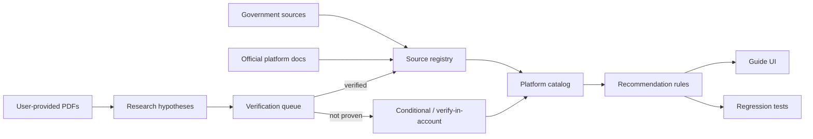
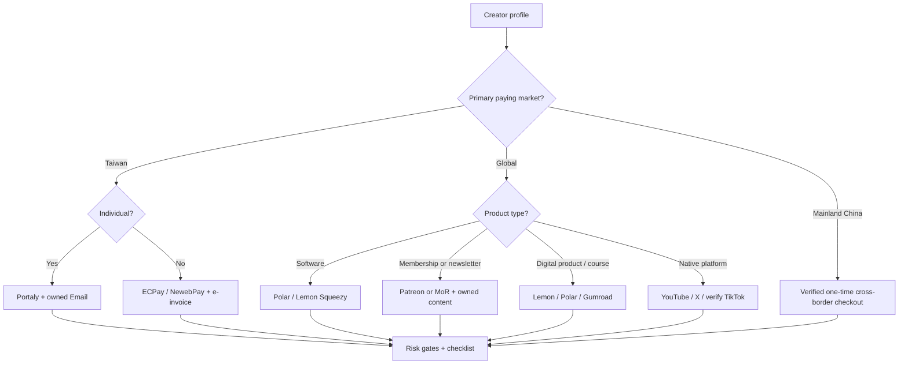
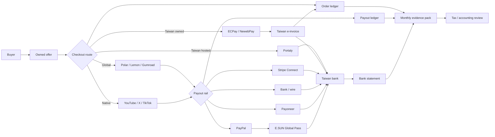
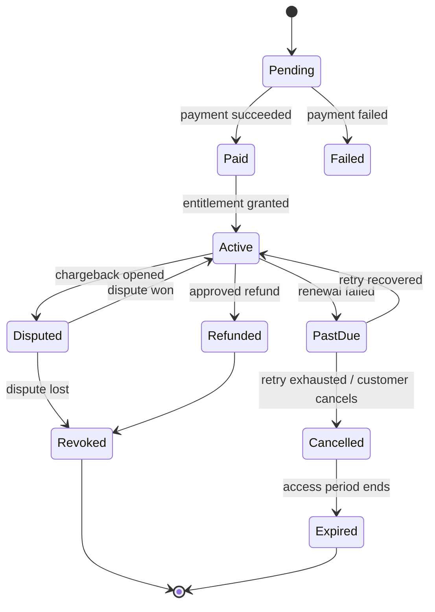
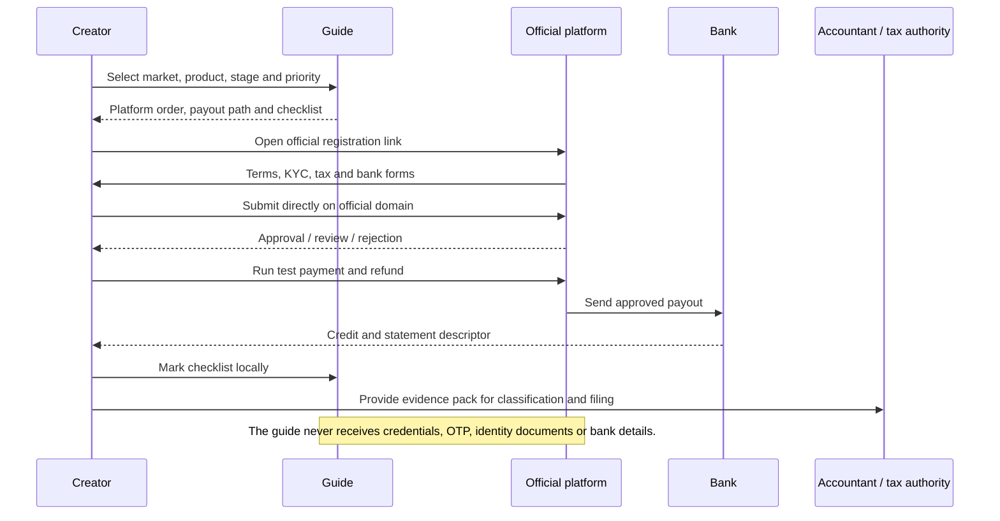
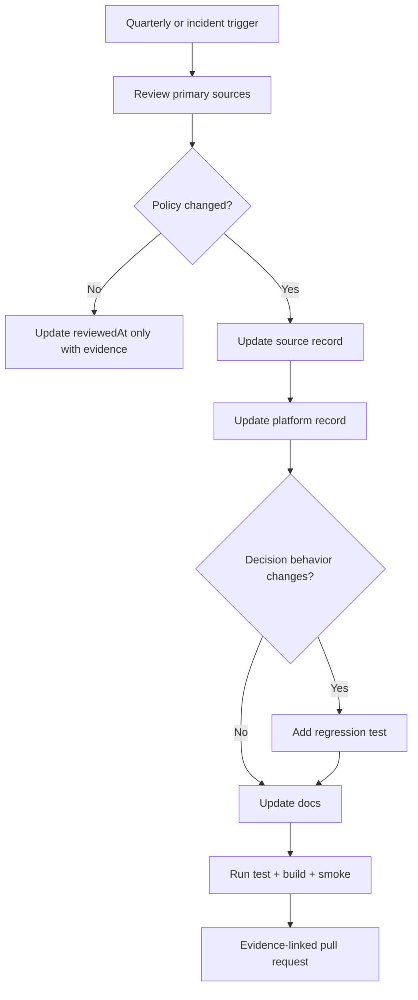

# Data Flow Diagrams

## 1. Evidence compilation

## 2. Creator decision flow

## 3. Money and evidence flow

## 4. Subscription transaction state

## 5. Registration guide boundary

## 6. Source refresh flow

